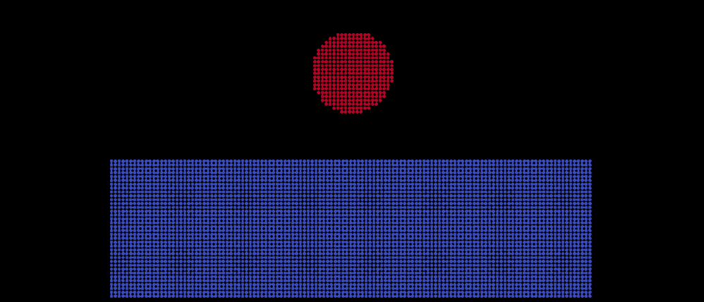
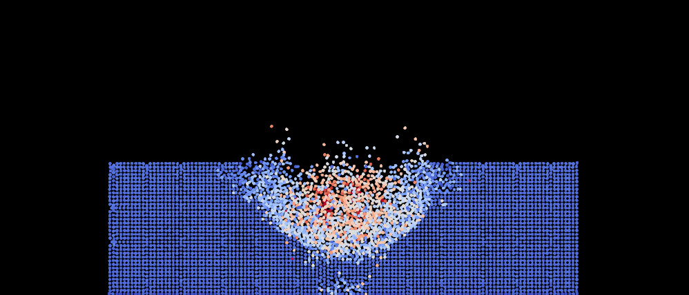
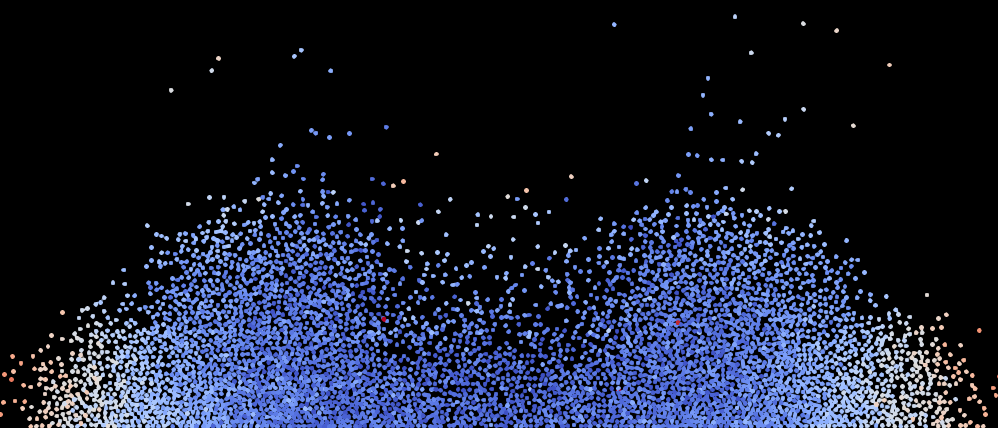

# Particle_System_Simulation_in_CPP
This project aims to create a particle system simulation in C++ that models the behavior of particles and simulates various interactions between them. The simulation will consider particles' properties such as position, velocity, and mass, and it will accurately depict forces like gravity, electrostatic forces, and other user-defined interactions.

